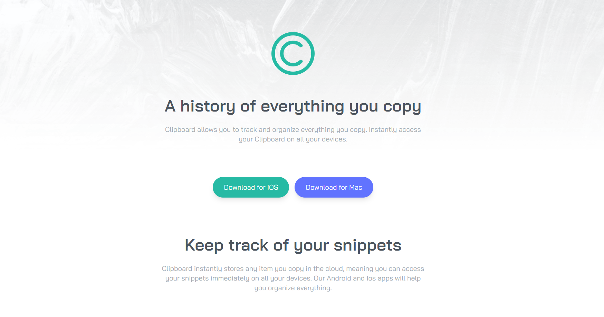
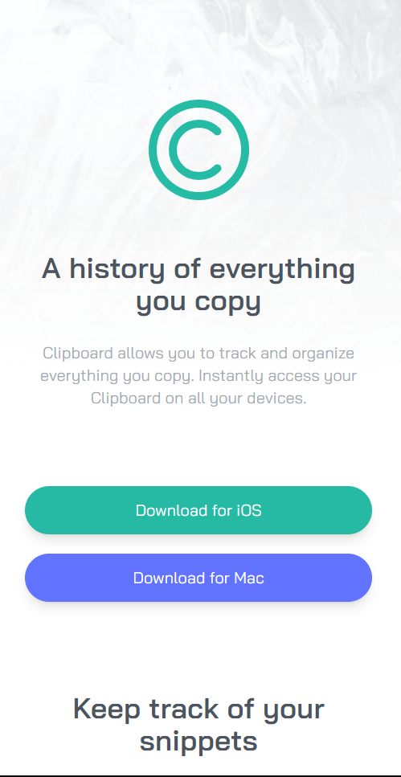

# Frontend Mentor - Clipboard landing page solution

This is a solution to the [Clipboard landing page challenge on Frontend Mentor](https://www.frontendmentor.io/challenges/clipboard-landing-page-5cc9bccd6c4c91111378ecb9). Frontend Mentor challenges help you improve your coding skills by building realistic projects. 

## Table of contents

- [Overview](#overview)
  - [The challenge](#the-challenge)
  - [Screenshot](#screenshot)
  - [Links](#links)
- [My process](#my-process)
  - [Built with](#built-with)
  - [What I learned](#what-i-learned)
- [Author](#author)

## Overview

### The challenge

Users should be able to:

- View the optimal layout for the site depending on their device's screen size
- See hover states for all interactive elements on the page

### Screenshot

### Links

- Solution URL: [Repositiory](https://github.com/Ismail142/Frotend-Mentor-Challanges/tree/Clipboard-landing-page)
- Live Site URL: [live site URL](https://clipboard-project-ismail.netlify.app)

## My process

### Built with

- Semantic HTML5 markup
- CSS custom properties
- Flexbox
- Desktop-first workflow

- [Tailwind CSS](https://tailwindcss.com/) -  CSS Framework

### What I learned

This project have really help me improve my web development skills by convert photos to real life breathing site.

## Author

- Website - Ismail Yahya
- Frontend Mentor - [@Ismail142](https://www.frontendmentor.io/profile/Ismail142)
- Twitter - [@Kali1421](https://twitter.com/Kali1421)

